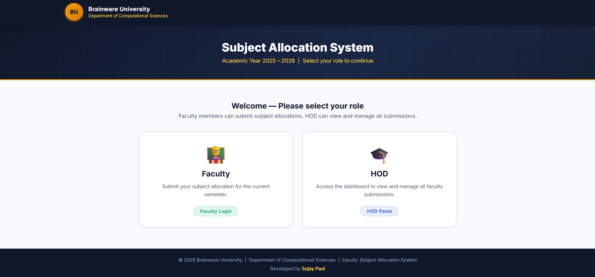
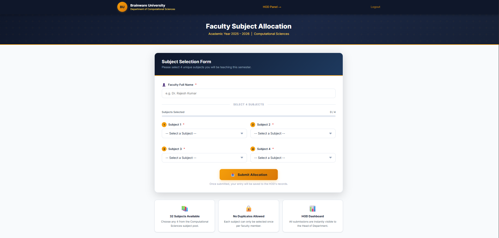
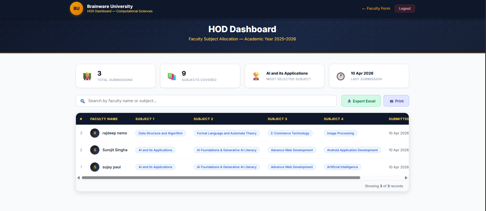

# Faculty Subject Allocation System

A lightweight, production-ready web application built for the Computational Sciences Department at Brainware University. The system streamlines the process of collecting and managing subject preferences from faculty members for the upcoming academic year.



## Overview

The Faculty Subject Allocation System provides a secure, intuitive interface for faculty to submit their teaching preferences. It replaces manual data collection with a centralized database, offering the Head of Department (HOD) a comprehensive dashboard to view, filter, manage, and export all allocations.

## Features

- **Automated Database Provisioning:** The application automatically creates the required database and tables upon first execution—no manual SQL imports needed.
- **Role-Based Access:** Separate, password-protected portals for Faculty members and the Head of Department.
- **Smart Form Validation:** Real-time client-side and server-side validation ensures faculty select exactly four unique subjects from the predefined pool.
- **HOD Dashboard:** A secure administrative panel providing real-time metrics (total submissions, subjects covered, most popular subject).
- **Instant Search:** Client-side filtering allows administrators to quickly search submissions by faculty name or subject.
- **Native Excel Export:** Generates true `.xlsx` spreadsheets (via `ZipArchive` and XML) for reliable data extraction without relying on third-party libraries.
- **Print-Optimized Views:** Custom CSS print queries generate clean, professional hard copies directly from the browser.
- **Responsive Design:** A custom, modern UI built with vanilla CSS that scales perfectly across devices.

## Tech Stack

The project embraces a minimalist approach, avoiding heavy frameworks in favor of native web technologies for maximum performance and straightforward deployment.

- **Frontend:** HTML5, Vanilla CSS3, Vanilla JavaScript (ES6+)
- **Backend:** PHP 7.4+
- **Database:** MySQL / MariaDB
- **Extensions:** `mysqli` (database operations), `zip` (Excel generation)

## Project Structure

```text
brainware-faculty/
├── config/                # Configuration and provisioning
│   └── db.php             
├── api/                   # Backend processing endpoints
│   ├── submit.php         
│   └── export-excel.php   
├── assets/                # Static web assets
│   ├── css/               
│   │   └── style.css      
│   └── js/                
│       ├── form.js        
│       └── dashboard.js   
├── docs/                  # Documentation and UI mockups
├── landing.php            # Role selection and authentication portal
├── index.php              # Authenticated faculty submission form
└── hod-dashboard.php      # Secure administrative dashboard
```

## Getting Started

### Prerequisites

To run this project locally, you will need a standard AMP stack (e.g., XAMPP, MAMP, or LAMP).

- PHP 7.4 or higher
- MySQL or MariaDB
- Apache or Nginx Web Server

### Installation

1. **Clone the repository** into your local web server's document root (e.g., `htdocs` for XAMPP):
   ```bash
   git clone https://github.com/EL-STRIX/Faculty-Subject-Allocation.git brainware-faculty
   ```

2. **Start your services**: Ensure both Apache and MySQL are running.

3. **Configure the Database (Optional)**:
   By default, `config/db.php` is configured to use `localhost`, the `root` user, and an empty password. If your local environment differs, update `config/db.php`:
   ```php
   define('DB_HOST', 'localhost');
   define('DB_USER', 'root');
   define('DB_PASS', '');
   define('DB_NAME', 'brainware_faculty');
   ```

4. **Initialize the Application**:
   Navigate to the project directory in your browser:
   ```text
   http://localhost/brainware-faculty/
   ```
   *The system will automatically create the `brainware_faculty` database and the necessary tables on the first visit.*

## Usage

### Faculty Portal
Faculty members can access the submission form by selecting the **Faculty** role from the landing page.
- **Access Password:** `brainware`

### HOD Dashboard
The Head of Department can access the administrative dashboard by selecting the **HOD** role from the landing page.
- **Access Password:** `brainware`
- From the dashboard, the HOD can view all submissions, search for specific records, delete incorrect entries, print reports, or download the full dataset as an Excel file.

## UI Previews

| Faculty Submission Form | HOD Management Dashboard |
| :---: | :---: |
|  |  |

## Contributors

- [Rajdeep Nemo](https://github.com/Rajdeep-Nemo)
- [Sujay Paul](https://github.com/Sujay-Paul)

## License

This project is distributed under the MIT License. See the `LICENSE` file for more information.

---

<div align="center">
  <p><i>Computational Sciences Department — Brainware University</i></p>
  <p><b>Academic Year 2025–2026</b></p>
</div>
